# Text-to-3D Models

Welcome to the **Text-to-3D Models** repository. This project is dedicated to generating 3D models from textual descriptions using cutting-edge machine learning models. The repository provides scripts, configurations, and tools to enable and facilitate the generation of diverse and high-quality 3D models from text prompts.

## Model Rendered Outputs

### Control4D Output


### Magic3D IF Output
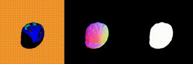

### DreamFusion IF Output


### Magic3D SD Output
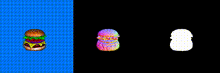

### ProlificDreamer Output
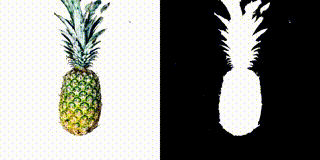

### Fantasia3D Output
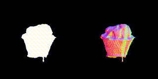
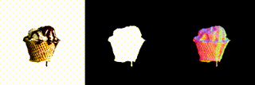

### ScoreJacobianChaining Output
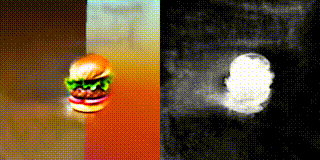

### Stable DreamFusion Output
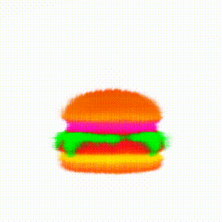
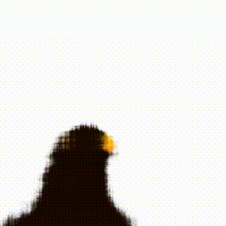

### Latent NeRF Output
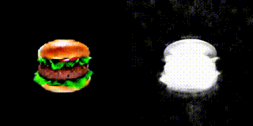
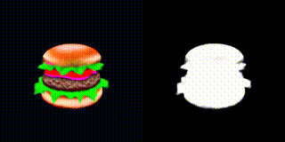

### Magic123 Output


### Magic3D IF Output - Coarse
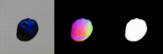

### TextMesh Output


### Shap-E Output
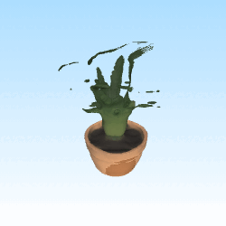

## Repository Structure

- **Models/**: Contains all the different models tested in this repository. Each model folder includes:
  - **README**: Documentation on model usage and specific configurations.
  - **Runner Script**: Scripts to initiate model training or generation.
  - **Sample Outputs**: Example outputs generated by each model, demonstrating its performance and capabilities.

## Tested Models

This repository includes configurations and scripts for various state-of-the-art text-to-3D models. Below is a list of the models and a brief description of each:

1. **Control4D**: Enables high-fidelity and spatiotemporal-consistent 4D portrait editing using text instructions.
2. **DreamFusion_IF**: Utilizes DeepFloyd IF for text-to-3D generation, producing high-quality 3D models from textual descriptions.
3. **DreamFusion_SD**: Employs Stable Diffusion for text-to-3D synthesis, creating 3D content guided by text prompts.
4. **Fantasia3D**: Generates highly detailed and high-fidelity 3D content based on user-provided meshes or ellipsoids.
5. **HiFA**: High-Fidelity 3D Asset generation model that creates detailed 3D assets from textual descriptions.
6. **InstructNeRF2NeRF**: Facilitates 3D editing with NeRF patch-based rendering, allowing modifications based on textual instructions.
7. **Latent_NeRF**: Trains NeRF models in the latent space of diffusion models, enabling efficient 3D content generation.
8. **Magic123**: A two-stage text-to-3D generation model that creates high-quality 3D textured mesh models from input text prompts.
9. **Magic3D_IF**: Utilizes DeepFloyd IF in Magic3D for high-resolution text-to-3D content creation.
10. **Magic3D_SD**: Employs Stable Diffusion in Magic3D for generating high-quality 3D models from textual descriptions.
11. **ProlificDreamer**: A unified framework for 3D content creation from text prompts, single images, and few-shot images.
12. **ScoreJacobianChaining**: A method for 3D content generation that leverages score-based models for improved quality.
13. **Shap-E**: Generates 3D objects conditioned on text or images, facilitating diverse 3D content creation.
14. **StableZero123**: Combines Zero123 with Stable Diffusion for efficient text-to-3D generation.
15. **Stable_DreamFusion**: A Stable Diffusion version of DreamFusion, enabling text-to-3D synthesis using diffusion models.
16. **TextMesh**: Generates 3D meshes from textual descriptions, allowing for detailed 3D model creation.
17. **Zero-1-to-3**: A model that facilitates 3D generation from a single image, enabling efficient 3D content creation.

Each model's directory contains sample outputs, offering insights into the model's performance and quality.

## Installation Guide

> **Recommended Environment**: This repository has been tested on **Ubuntu 22.04 (LTS)** with an **NVIDIA RTX 4090 24GB GPU**. CUDA version **11.8** was used for all models. These specifications are recommended to achieve optimal performance and compatibility.

Follow the steps below to set up the environment required to run these models:

1. **Clone Bits and Bytes Repository**
   Clone the repository for the `bitsandbytes` library, which provides efficient GPU support.
   ```bash
   git clone https://github.com/bitsandbytes-foundation/bitsandbytes.git
   ```

2. **Run CUDA Installation Script**
   Navigate to the `bitsandbytes` directory and install the required CUDA version (in this example, CUDA 11.8):
   ```bash
   cd bitsandbytes
   python install_cuda.py 118
   ```

3. **Set CUDA Paths**
   Ensure CUDA paths are correctly set up for your environment:
   ```bash
   export PATH=/home/cap6411.student2/cuda/cuda-11.8/bin:$PATH
   export LD_LIBRARY_PATH=/home/cap6411.student2/cuda/cuda-11.8/lib64:$LD_LIBRARY_PATH
   ```

4. **Refresh Shell Configuration**
   Load the new configurations by refreshing your shell’s `.bashrc` file:
   ```bash
   source ~/.bashrc
   ```

5. **Verify CUDA Installation**
   - Check the `nvcc` version to ensure CUDA is correctly installed:
     ```bash
     nvcc --version
     ```
   - Verify NVIDIA drivers with `nvidia-smi` to check GPU status:
     ```bash
     nvidia-smi
     ```

Now that the environment is set up, follow the model-specific README file in the `Models/` directory to run the model of your choice. Each model's README includes instructions and example commands tailored to that model.

## Contributing

Contributions to this project are welcome. If you have improvements or new models to add, please fork the repository, make your changes, and submit a pull request. Make sure your contributions include relevant documentation, scripts, and sample outputs to maintain consistency with the existing structure.

## License

Refer to the original model repositories for specific licensing information. This repository may contain code and configurations from multiple sources with varying licenses.

---

*Note: Ensure you have all necessary dependencies and environment configurations as specified in the setup guides before running the scripts.*
